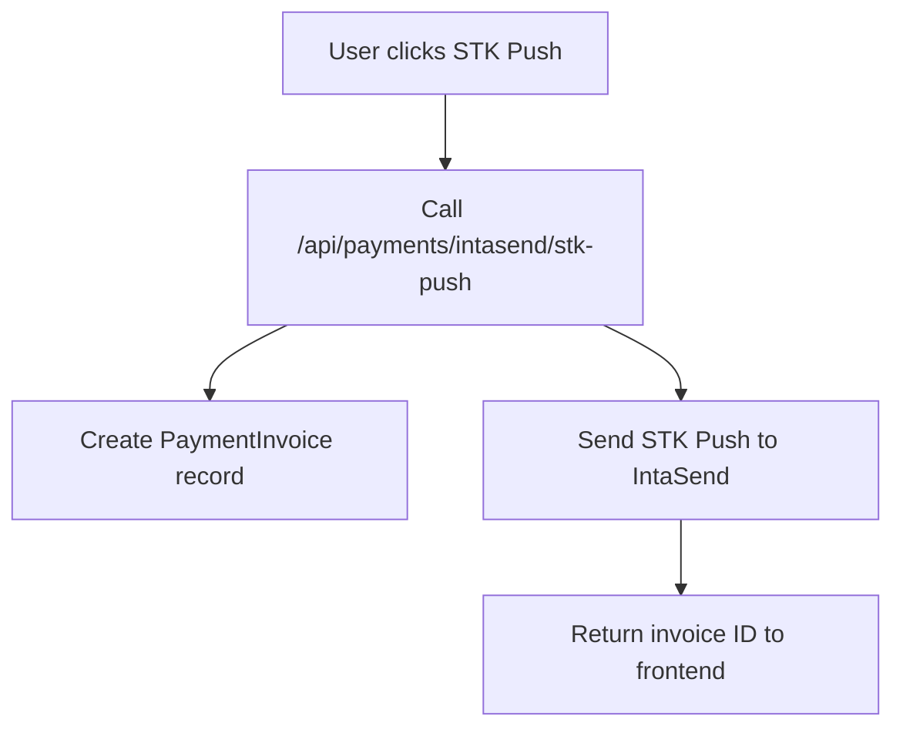
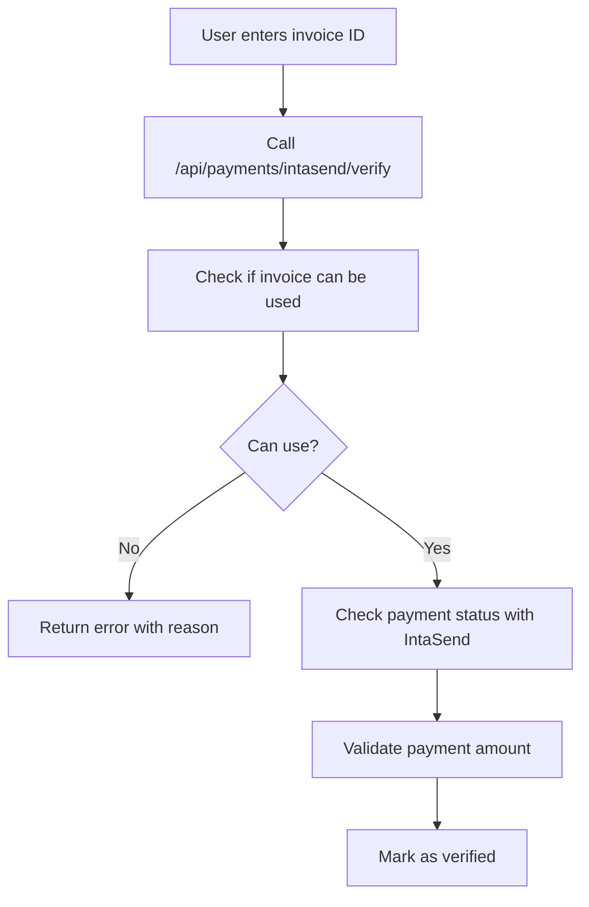
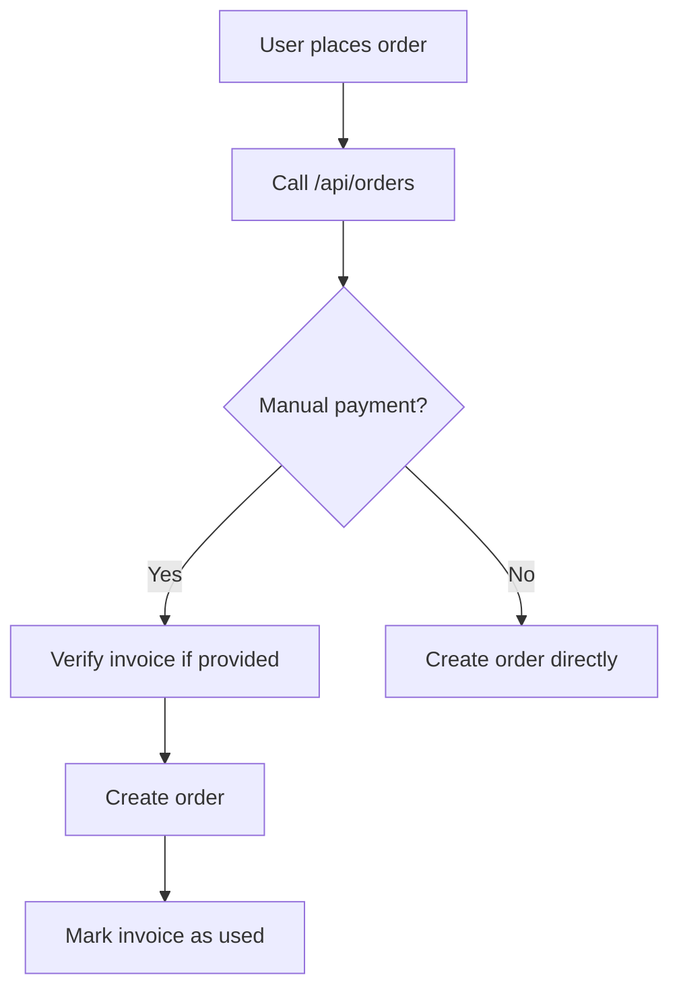

# Payment Invoice Tracking System Documentation

## Overview

This system implements comprehensive fraud prevention for IntaSend payments by tracking invoice IDs and preventing their reuse across multiple orders. The system ensures that each payment can only be used once and provides proper validation before order creation.

## Key Features

### 1. Invoice Lifecycle Management
- **Creation**: Invoices are created when STK Push is initiated
- **Tracking**: Real-time status updates from IntaSend
- **Expiration**: Automatic cleanup of expired invoices
- **Usage Tracking**: Prevents invoice reuse across orders

### 2. Fraud Prevention
- **Amount Validation**: Ensures payment matches expected order total
- **Invoice Reuse Prevention**: Each invoice can only be used once
- **Expiry Checking**: Expired invoices cannot be used
- **Status Validation**: Only completed payments are accepted

### 3. Database Schema

#### PaymentInvoice Table
```sql
model PaymentInvoice {
  id               String               @id @default(cuid())
  invoiceId        String               @unique  -- IntaSend invoice ID
  orderId          String?                       -- Optional - set when order is created
  order            Order?               @relation(fields: [orderId], references: [id])
  provider         String               @default("intasend")
  status           PaymentInvoiceStatus @default(CREATED)
  amount           Float                         -- Original payment amount
  expectedAmount   Float?                       -- Expected amount with fees
  phoneNumber      String?                      -- Phone number used for payment
  isUsed           Boolean              @default(false)
  expiresAt        DateTime                     -- When invoice expires
  metadata         String?                      -- JSON string for additional data
  createdAt        DateTime             @default(now())
  updatedAt        DateTime             @updatedAt
}
```

#### PaymentInvoiceStatus Enum
```sql
enum PaymentInvoiceStatus {
  CREATED     -- Invoice created but payment not initiated
  PENDING     -- Payment initiated but not completed
  COMPLETE    -- Payment completed successfully
  FAILED      -- Payment failed
  EXPIRED     -- Invoice expired
  USED        -- Invoice used for order creation
}
```

## API Endpoints

### 1. STK Push Initiation
**POST** `/api/payments/intasend/stk-push`

Creates invoice record when STK Push is initiated:
```typescript
{
  phone: "254712345678",
  amount: 1000,
  orderId?: "optional-order-id"
}
```

**Response:**
```typescript
{
  success: true,
  data: {
    invoiceId: "INT_xxx",
    originalAmount: 1000,
    serviceFee: 2,
    intaSendFee: 30,
    totalAmount: 1032
  }
}
```

### 2. Payment Status Checking
**GET** `/api/payments/intasend/status/[invoiceId]?expectedAmount=1000`

Updates invoice status based on IntaSend response.

### 3. Payment Verification (Fraud Prevention)
**POST** `/api/payments/intasend/verify`

```typescript
{
  invoiceId: "INT_xxx",
  expectedAmount: 1000
}
```

**Validation Checks:**
- Invoice exists and is not expired
- Invoice has not been used for another order
- Payment is completed on IntaSend
- Payment amount matches expected total (with tolerance)

**Response on Success:**
```typescript
{
  success: true,
  message: "Payment verified successfully",
  data: {
    invoiceId: "INT_xxx",
    paymentState: "COMPLETE",
    amount: 1032,
    currency: "KES",
    paidAt: "2025-10-11T...",
    validationDetails: { ... }
  }
}
```

**Response on Failure:**
```typescript
{
  success: false,
  error: "Invoice already used for another order",
  customerMessage: "Payment verification failed: Invoice already used for another order",
  details: {
    isUsed: true,
    associatedOrder: "ord_xxx"
  }
}
```

## Implementation Flow

### 1. Payment Initiation


### 2. Payment Verification


### 3. Order Creation


## Utility Functions

### Core Functions in `lib/payment-invoices.ts`

1. **createPaymentInvoice(data)** - Create new invoice record
2. **findPaymentInvoice(invoiceId)** - Find invoice by ID
3. **canUseInvoice(invoiceId)** - Check if invoice can be used
4. **markInvoiceAsUsed(invoiceId, orderId)** - Mark invoice as used
5. **updateInvoicePaymentStatus(invoiceId, status)** - Update status
6. **cleanupExpiredInvoices()** - Clean expired invoices
7. **getInvoiceStats()** - Get statistics for monitoring

### Fraud Prevention Checks

```typescript
async function canUseInvoice(invoiceId: string) {
  const invoice = await findPaymentInvoice(invoiceId);
  
  if (!invoice) return { canUse: false, reason: 'Invoice not found' };
  if (invoice.isUsed) return { canUse: false, reason: 'Invoice already used' };
  if (invoice.expiresAt < new Date()) return { canUse: false, reason: 'Invoice expired' };
  if (invoice.status === 'FAILED') return { canUse: false, reason: 'Payment failed' };
  
  return { canUse: true, invoice };
}
```

## Maintenance

### 1. Cleanup Script
Run periodically to clean expired invoices:
```bash
npx tsx scripts/cleanup-expired-invoices.ts
```

### 2. Monitoring
Check invoice statistics:
```bash
curl http://localhost:3000/api/admin/payment-invoices/stats
```

### 3. Testing
Run comprehensive tests:
```bash
npx tsx scripts/test-payment-invoices.ts
```

## Security Benefits

1. **Prevents Double Spending**: Each invoice can only be used once
2. **Amount Validation**: Ensures payment matches order total
3. **Expiry Protection**: Old invoices cannot be reused
4. **Audit Trail**: Complete tracking of invoice lifecycle
5. **Status Validation**: Only successful payments are accepted

## Error Handling

The system provides detailed error messages for different failure scenarios:

- **Invoice not found**: Invalid or non-existent invoice ID
- **Invoice expired**: Payment window has closed
- **Invoice already used**: Attempted reuse prevention
- **Payment not completed**: IntaSend status is not COMPLETE
- **Amount mismatch**: Payment doesn't match expected total

## Integration Points

1. **Checkout Page**: Uses verification API for manual payments
2. **Order Creation**: Validates and marks invoices as used
3. **Payment Status**: Real-time updates from IntaSend
4. **Admin Dashboard**: Statistics and monitoring (future)

This system provides comprehensive fraud prevention while maintaining a smooth user experience for legitimate payments.